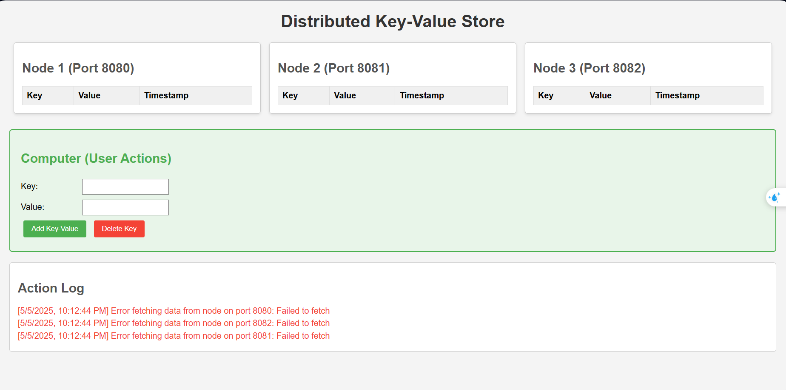

Distributed Key-Value Store Project
This project implements a distributed key-value store inspired by Chapters 5 (Sharding) and 6 (Data Partitioning and Replication) of System Design Interview: An Insider's Guide by Alex Xu. It is designed as a hands-on learning tool for system design concepts, particularly for junior-level interview preparation. The system runs three nodes on ports 8080, 8081, and 8082, using sharding to distribute data and timestamp-based versioning for conflict resolution.
Overview
The application is built with Java 17, Spring Boot, and Gradle, featuring a web-based interface to interact with the distributed store. Users can add and delete key-value pairs, with the data dynamically displayed across the nodes. The project emphasizes scalability, availability, and eventual consistency, aligning with distributed system design principles.
Current Implementation
Key Features

Sharding: Data is partitioned across three nodes using a simple hash-based sharding function (hash(key) % 3).
Versioning: Timestamps ensure last-write-wins conflict resolution for concurrent updates.
Distributed Architecture: Nodes communicate via HTTP to forward requests to the appropriate shard.

File Purposes

build.gradle.kts: Configures the Gradle build with Java 17 and Spring Boot dependencies. Ensures the project compiles and runs with the defined version (0.0.1-SNAPSHOT).
KeyValueStoreApplication.java: The main entry point that launches three nodes in separate threads on ports 8080, 8081, and 8082 (will do the dynamic node set-up later). Includes port availability checks and error handling for robust startup.
KeyValueEntry.java: Defines the data model for key-value pairs, including a timestamp for versioning.
NodeStorage.java: Manages in-memory storage for each node, providing methods to put, get, delete, and list key-value entries.
NodeConfig.java: Holds configuration details for each node (ID, port, and list of all nodes) for distributed communication.
KeyValueService.java: Implements the business logic, computing shard IDs, handling PUT, GET, and DELETE operations, and forwarding requests to the correct node.
KeyValueController.java: Exposes REST endpoints (/api/kv/put, /api/kv/get, /api/kv/delete, /api/kv/list) to interact with the service, with CORS support and detailed error handling.
index.html: 

Build and Run:
Run gradle build to compile.
Access the interface at http://localhost:8080/.

Usage:
Add a key-value pair (e.g., key: user123, value: Alice) via the Computer section.
Delete a key and observe updates in the node tables and log.
Check the action log for results or errors.

Future Directions

Replication: Implement data replication across nodes for fault tolerance (Chapter 6), ensuring data availability if a node fails.
Consistent Hashing: Replace the current modulo-based sharding with consistent hashing to reduce rehashing costs during node additions/removals (Chapter 5).
ance learning and interview readiness.
